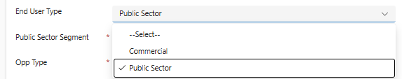

# Opportunity Creation Flow — Spec

Fill in `[ANSWER]` blocks. Leave `[CONFIRMED]` if my read is right; replace it with the correct value if not. Add bullets anywhere you need to add info.

---

## 1. Stage list

Stages in order, with probability % each maps to:

| # | Stage | Probability | Notes |
|---|---|---|---|
| 1 | Prospecting | 5 | [CONFIRMED / fix] |
| 2 | Validated | 25 | [CONFIRMED / fix] |
| 3 | Qualified | 50 | [CONFIRMED / fix] |
| 4 | Verbal Received | 75 | [CONFIRMED / fix] |
| 5 | Contract Received | 100 | [CONFIRMED / fix] |
| 6 | Billing Rejection | 100 | [ANSWER — terminal? side-branch?] |
| 7 | Pending Vendor Confirmation | 100 | [CONFIRMED / fix] |
| 8 | Purchased | 100 | terminal — [CONFIRMED / fix] |

**Q1.1** Is this the same stage list for AWS *and* Azure? `yes`

**Q1.2** Any stages I missed? `no`

**Q1.3** Does `Billing Rejection` end the flow, or can you re-enter the pipeline from there? `can re-enter`

---

## 2. Always-required base fields

These are required regardless of vendor / stage:

- [X] Subject
- [ ] Status
- [X] AccountID
- [X] Contact
- [ ] Single Or Cross Sell
- [ ] Type
- [ ] Primary Vendor
- [ ] Opp Type
- [ ] Country
- [ ] Currency
- [ ] Opp Stage
- [ ] Probability (auto-set)
- [ ] BCN — `[required - autofill]`
- [ ] Record Type — `[sales]`
- [ ] Source — `[cloud]`

**Q2.1** Anything else always-required I missed? `[Estimated MRR, Annual Revenue]`

---

## 3. Vendor-specific required fields

### 3a. AWS

When Primary Vendor = one of the AWS accounts:

`
Column order of the Primary vendors: Vendor name, Country, Created On, Group Name, Master Number, Vendr Number, Is cloud vendor

`

Required when AWS:
- [X] APN ID
- [X] AWS Partner Type
- [X] AWS Service Type
- [X] APN Tagging
- [X] End User Type
- [X] Support Type
- [X] Payer Account

**Q3a.1** Same required set for *all* AWS variants? Or does AWS-CONSOLIDATED differ from AWS-STANDALONE? `[no, its the same]`

**Q3a.2** "AWS Vendor Fields" right-side section (ACE Customer Website, ACE Delivery Model, ACE Expected Monthly AWS Rev, ACE Industry, ACE Is Opp from Marketing Activity, ACE Primary need for AWS, ACE Use Case, ACE Sales Activities, ACE Solution Offered, ACE APN Programs, Integration Status, ACE Owner Email/Name, ACE Partner Acceptance, ACE Stage, ACE Unique Identifier, ACE Error):
- When does it appear? `[not needed, don't add]`
- Are any of these fields **required** (vs read-back from AWS)? `[don't add]`

### 3b. Microsoft / Azure

Vendors: `MICROSOFT - AZURE`, `MICROSOFT - CLOUD` (Microsoft NV - NCE excluded per user)

Required when Microsoft:
- [X] MS CSP Tenant
- [X] MPN ID
- [X] Migration Type
- [X] End User Type
- [X] Service Name
- [X] Competitive Winback (required, not optional)

**Q3b.1** Do MICROSOFT - CLOUD and MICROSOFT - AZURE require the same fields? `yes — same set`

### 3c. Other vendors

**Q3c.1** Any other vendors with their own required-field rules (Google Cloud, IBM, Cisco, etc.)? `[not yet]`

---

## 4. Conditional fields (dropdown-driven)

### 4a. AWS Service Type → adds fields

Values:
- Direct Consolidation
- Direct Consolidation – Cloud Marketplace (CMP)
- New Reseller Account – No Root Access
- New Sub Account – No Root Access
- RI Program Management

For each, list which fields appear / become required:

| AWS Service Type value | Fields added | Of those, required |
|---|---|---|
| Direct Consolidation | Existing Payee Account, Consolidation Acceptance Date |
| Direct Consolidation – CMP | `Existing Payee Account, Consolidation Acceptance Date` |
| New Reseller Account – No Root Access | `none` |
| New Sub Account – No Root Access | `none` |
| RI Program Management | `none` |

**Q4a.1** Which of these = "Consolidated" and which = "Standalone" in your terminology? `[Both, we use both]`

### 4b. Azure End User Type → adds Public Sector Segment

**Q4b.1** Which value of End User Type triggers Public Sector Segment? `[public sector only]`

**Q4b.2** Full End User Type option list: []

**Q4b.3** Public Sector Segment options I saw: SLG–IMGSA, EDU–IMGSA, Federal–IMGSA, Healthcare–IMGSA, SLG–IMNCPA, EDU–IMNCPA, Federal–IMNCPA, Healthcare–IMNCPA, SLG–No Contract, EDU–No Contract, Federal–No Contract, Healthcare–No Contract, Non-Profit, SLG–IM OMNIA, EDU–IM OMNIA, Healthcare–IM OMNIA. Complete list? `[yes]`

### 4c. Azure Opp Type → conditional

Values: Services, SPA, SPA - Partner Agreement, CMP, Trad, MPO2Connect, Azure Private Offer, Breath

**Q4c.1** Does any specific Opp Type add/remove required fields? `[no]`

**Q4c.2** Is `Service Name` required for **all** Azure Opp Types, or only some? `[not required, don't add]`

### 4d. Azure Migration Type

Values: CSP to CSP, Current Partner with Transition, EA to CSP, ISV, New Reseller, PAYG, Tier 1

**Q4d.1** Does any value add fields? `[no]`

### 4e. Single Or Cross Sell

**Q4e.1** Does `Cross Sell` add a Secondary Vendor / extra fields? `[no]`

### 4f. Status (Open/Won/Lost) — handled via close dialogs, NOT a regular field

Status is `Open` by default and stays Open through every stage. Won/Lost is set via dedicated **Close as Won** / **Close as Lost** actions that open a dialog. (Mirrors D365.)

**Close as Won dialog fields:**
- Status reason * — dropdown: `Purchased`, `Bulk Closed`, `Won`, `PO received`, `Invoiced to Reseller`, `Deal Analyzer-Approved`
- Actual revenue * (currency, defaults to 0)
- Close date * (defaults to today)
- Competitor (optional, account lookup)
- Description (optional, text)

**Close as Lost dialog fields:**
- Status reason * — dropdown: `Returned`, `Auto-Created`, `Budgetary Only`, `No Stock`, `Lost/Not Pursued`, `Duplicate Opportunity`, `Reseller / Partner Lost Opportunity`, `Duplicate Vendor`, `Not Interested`, `Won with Another Reseller`, `Gone Direct`, `Won by Cloud`, `No Feedback from Customer`, `Won`, `Lack of Credit`, `Bulk Closed`, `Declined`, `Cancelled`, `Out Sold`, `Lost to IM Competitor`, `Postponed / Put On Hold`, `Not Interested`, `Price`, `Solution`, `Partner Taken In house`, `Service not Required`, `Kit Decommissioned`, `System Bulk Close Job`, `Deal Analyzer Rejected`
- Actual revenue * (currency, defaults to 0)
- Close date * (defaults to today)
- Competitor (optional, account lookup)
- Description (optional, text)

### 4g. Multi-vendor flag

**Q4g.1** Current CRM has a "Multi-vendor opportunity" checkbox. Still relevant? Drop? `[drop]`

---

## 5. Stage gates

**Q5.1** Does D365 actually **block** stage advancement until certain fields are filled, or does it let you advance freely? My read from the videos: it lets you advance freely. `[CONFIRMED its freely / fix]`

**Q5.2** If there ARE stage-specific gates, list them:

| Stage | Required to leave |
|---|---|
| Prospecting | `[ANSWER or "none"]` |
| Validated | `[ANSWER or "none"]` |
| Qualified | `[ANSWER or "none"]` |
| Verbal Received | `[ANSWER or "none"]` |
| Contract Received | `[ANSWER or "none"]` |
| Pending Vendor Confirmation | `[ANSWER or "none"]` |

---

## 6. Field defaults & behavior

**Q6.1** Country: always defaults to Belgium, never changed? `[Let choose between Belgium, Luxemburg, or Netherlands]`

**Q6.2** Currency: always defaults to Euro, never changed? `[Dollar]`

**Q6.3** Source: always = "Cloud" for these vendors? Other valid values? `[yes]`

**Q6.4** Record Type: always = "Sales"? `[Yes]`

**Q6.5** Probability: locked by stage (read-only)? Or override-able? `[read-only]`

**Q6.6** Expiration Date: defaults to today + 7 days based on what I saw. Confirm? `[let user choose but add default]`

**Q6.7** Stage Start Date / Days since Open / Days since in current stage: auto-calculated, never user-edited? `[yes]`

---

## 7. UX for the rebuild — final

**Stepper / wizard, manual stage advancement, dedicated close actions.**

- Stepper UI organizes fields by stage (Prospecting → Validated → ... → Pending Vendor Confirmation → Purchased). User can click any stage tab to view/fill its fields. **No gating** — clicking a stage doesn't change `Opp Stage`, just navigates the form.
- `Opp Stage` is set explicitly by the user via dropdown (or "Mark this stage" button on each stepper tab). Saving never auto-advances the stage.
- Status stays `Open` through every stage. `Won` / `Lost` is set only via explicit **Close as Won** / **Close as Lost** buttons, which open the close dialogs from §4f.
- User can save partial state at any time and resume later.
- **Status and ID fields are not shown on the New Opportunity form** — they're assigned by D365 after the first save and become visible only on existing records.

---

## 8. Anything I missed

Free-form. Drop notes, screenshots, edge cases, gotchas:

`Make sure the Customer Need input field is also required`
